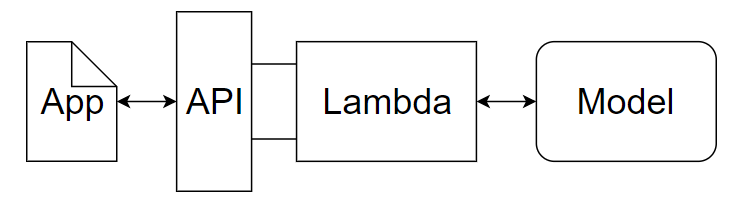

# Build and Deploy a LSTM Model for Sentiment Analysis on SageMaker

In this project, we are interested in helping an entertainment company understand their customers' feedback about their movies. In particular, we have collected a bunch of reviews in text format about the company movies and would like to classify if those reviews are positive or negative. To this end, in this project, we present an end-to-end machine learning process from wrangling the data, building the classification model, to then deploying it as a web app using Amazon SageMaker. We introduce both a way to process the reviews in batch and the web app for interacting/testing our model. Although this project focuses specifically on movie reviews, the workflow in this project can be extended to understand customers' reaction to other kinds of products.

## Dataset

We will be using the [IMDb dataset](http://ai.stanford.edu/~amaas/data/sentiment/), which contains 25,000 highly polar movie reviews for training, and 25,000 for testing. An example of a postive review is given below

> The violent and rebel twenty-five years old sailor Antwone Fisher (Derek Luke) is sent to three sessions for evaluation with the navy psychiatrist Dr. Jerome Davenport (Denzel Washington), after another outburst and aggression against a superior ranked navy man. Reluctant in the beginning of the treatment, he gets confidence in Dr. Davenport and discloses his childhood, revealing painful traumas generated in his foster house. Meanwhile, he meets Cheryl Smolley (Joy Briant), and they fall in love for each other. Resolving his personal problems, Antwone becomes a new man. This true familial drama is a touching and positive story of a man who finds a friend and is sent back to a regular life. The direction of Denzel Washington is excellent, making sensitive, attractive and with good taste, a story about child abuse. In the hands of another director, it might be a very heavy story. My vote is eight.  Title (Brazil): 'Voltando a Viver' ('Returning to Live')

## Data Wrangling

The main wrangling steps are:
- Tranform each review into a list of words (removing HTML tags, punctuations, stopwords, etc.)
- Building a dictionary of 5,000 most popular words and mapping each word to an integer
- Tranform each list of words of a review into a fixed-size vector of integer using the dictionary
- Upload the transformed data to S3 ready for model building

## Modeling

The main steps are:
- Write a structure of the LSTM model 
- Write the training code for the model (i.e., SageMaker entry point)
- Use SageMaker to train the model

## Model Testing

The main testing steps are:
- Deploy the model that allows testing through an endpoint
- Test batches of input by splitting them and send through the endpoint
- Identify the steps needed to test a raw input (to prepare for webapp deployment)

# Webapp Deployment

The main deploying steps are:
- Write inference code to process raw input and return prediction
- Deploy the model
- Test the model with a few data samples
- Setup a Lambda function that responds to the request from the Webapp API by invoking the predictive model
- Setup an API Gateway for the Webapp
- Paste the API to the Webapp

Now we get a Webapp that is up and running. When we paste a review into the webapp and ask for prediction, the review will be sent by the API to the Lambda function, which will invoke the predicting model to process and return the prediction result. A graph of the process is given as follows.

